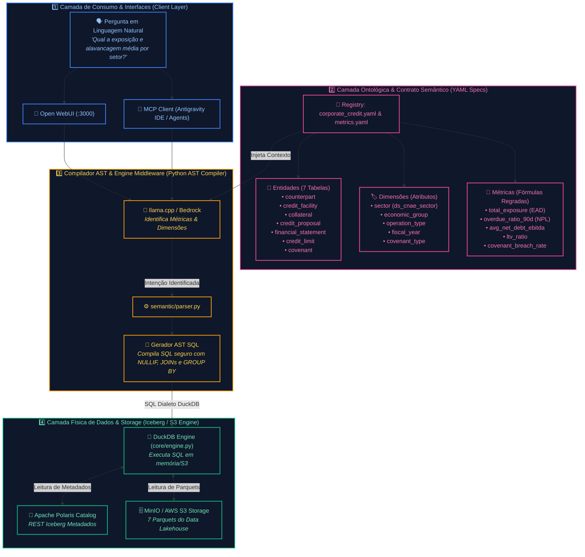
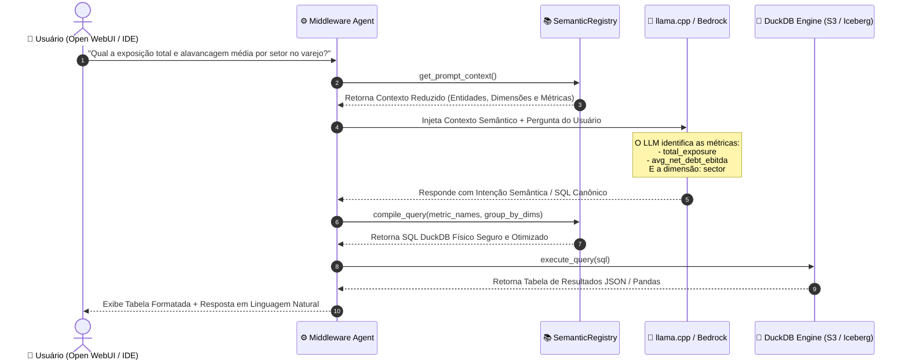
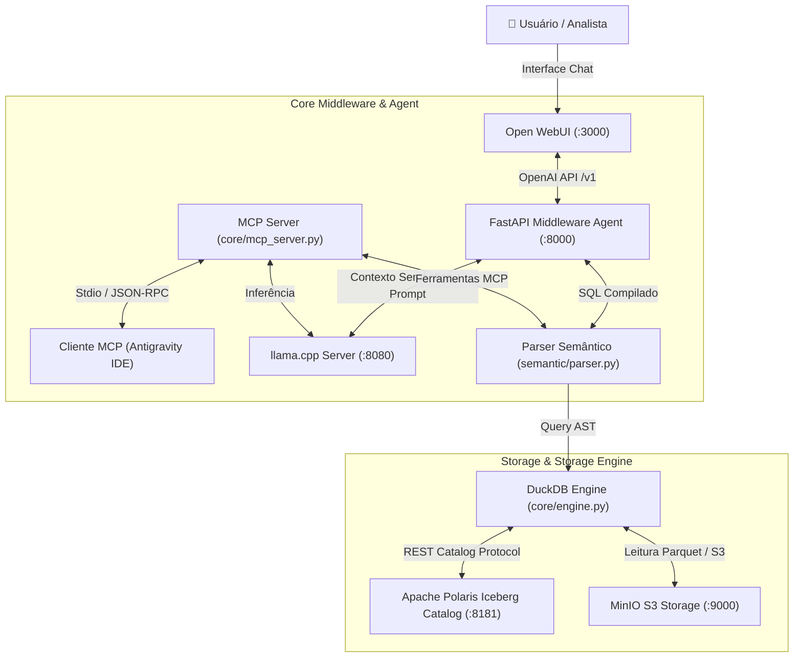
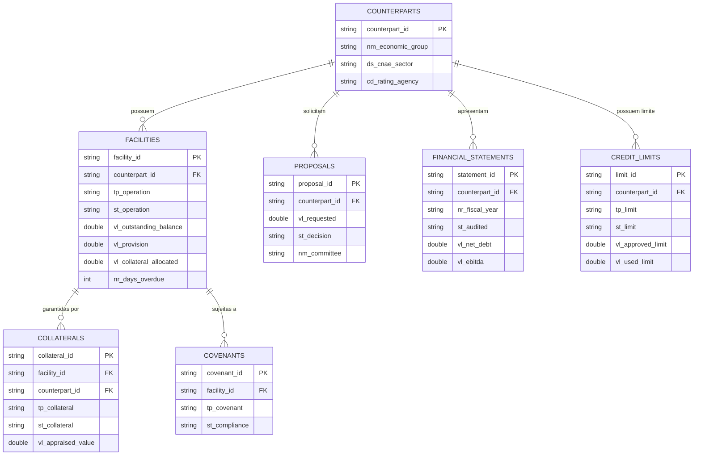
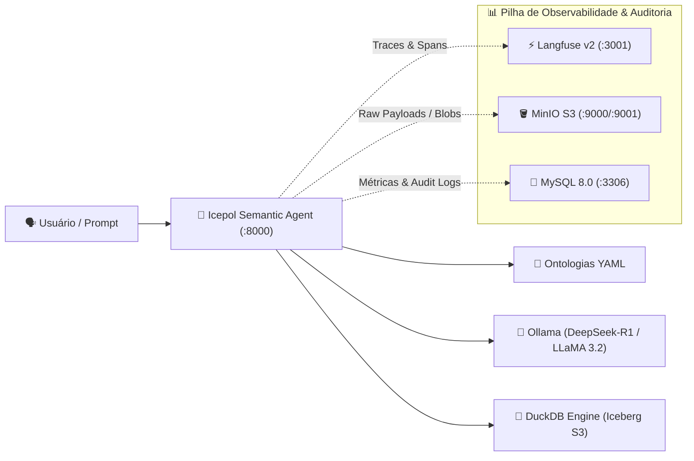

# icepol-semantic 🧊⚖️

**Ecossistema 100% Local de Inteligência Analítica em Crédito Corporativo (Wholesale Banking) impulsionado por Camada Semântica, Apache Iceberg, DuckDB, Llama.cpp e Model Context Protocol (MCP).**

---

## 📋 Sumário
1. [Imersão Teórica e Literatura: O que é e por que a Camada Semântica existe?](#-imersão-teórica-e-literatura-o-que-é-e-por-que-a-camada-semântica-existe)
2. [A Evolução Histórica da Camada Semântica (De Inmon & Kimball ao GenAI)](#-a-evolução-histórica-da-camada-semântica-de-inmon--kimball-ao-genai)
3. [O Pipeline de Compilação: Texto -> Intenção -> AST -> SQL Físico](#-o-pipeline-de-compilação-texto---intenção---ast---sql-físico)
4. [Arquitetura da Solução Local & Observabilidade](#-arquitetura-da-solução-local)
5. [Modelagem Ontológica do Domínio (7 Tabelas Físicas de Crédito)](#-modelagem-ontológica-do-domínio-7-tabelas-físicas-de-crédito)
6. [Observabilidade Corporativa (Langfuse, MinIO S3 & MySQL 8.0)](#-observabilidade-corporativa-langfuse-minio-s3--mysql-80)
7. [Vídeos Demonstrativos & Mermaid Interativo](#-vídeos-demonstrativos--mermaid-interativo)
8. [Como Executar e Utilizar](#-como-executar-e-utilizar)
9. [Integração via Model Context Protocol (MCP)](#-integração-via-model-context-protocol-mcp)
10. [Guia de Portabilidade para AWS Cloud & Arquitetura SVG](#-guia-de-portabilidade-para-aws-cloud--arquitetura-svg)

---

## 🔬 Imersão Teórica e Literatura: O que é e por que a Camada Semântica existe?

A **Camada Semântica** (*Semantic Layer*) é a camada de abstração analítica projetada para mapear e traduzir **conceitos de negócio heterogêneos** (métricas, entidades, dimensões e relacionamentos) em **instruções executáveis de código analítico (SQL/AST)** sobre bancos de dados físicos.

---

### 1. A Evolução Histórica da Camada Semântica: A Escalada para a Inteligência Artificial


Para compreender como a Camada Semântica se tornou o pilar central da Inteligência Artificial em Dados, analisamos sua evolução como uma **Escalada até o Cume (Mountain Peak Progression)** ao longo de 4 eras:

#### 🏛️ A. Era 1: Modelagem Dimensional de Ralph Kimball (1990s)
Na literatura clássica de Data Warehousing (*The Data Warehouse Toolkit* por Ralph Kimball e Margy Ross), o problema do acoplamento foi abordado dividindo os dados em **Tabelas de Fatos** (eventos numéricos/métricas) e **Tabelas de Dimensões** (contextos qualitativos). Contudo, as regras de cálculo ainda ficavam engessadas em cubos OLAP proprietários ou views SQL engessadas.

#### 🏢 B. Era 2: LookML & A Invenção do *Semantic Layer-as-Code* (2010s)
Com a criação do Looker e do **LookML**, a camada semântica passou a ser declarativa e versionada via Git. Em vez de escrever SQL bruto, os engenheiros definiam *Dimensions* e *Measures*.

#### ⚡ C. Era 3: Headless Semantic Layer no Modern Data Stack (2020s)
Ferramentas como **Cube.dev**, **dbt MetricFlow** e **Google Malloy** popularizaram o conceito de *Headless Semantic Layer* (Camada Semântica Desacoplada): a lógica de negócio existe em uma camada universal e serve a qualquer consumidor (Tableau, Python, APIs, Excel).

#### 🤖 D. Era 4: O Guardrail Imutável para Agentes de IA e Text-to-SQL (2024+)
Com a ascensão dos Grandes Modelos de Linguagem (LLMs), a camada semântica tornou-se a **peça mais crítica para o sucesso de aplicações de Text-to-SQL**. Sem ela, o LLM sofre do fenômeno da *Adivinhação de Schema*: tenta adivinhar nomes de colunas, inventar joins e aplicar regras matemáticas incorretas.

---

### Como a Camada Semântica Funciona?


Para entender de forma simples e intuitiva:

1. **O Mundo Superior (Linguagem Humana):** O usuário faz perguntas do dia a dia (*"Qual é o crédito total?"*, *"Mostre as métricas de inadimplência!"*).
2. **A Ponte de Tradução (Camada Semântica):** No meio do caminho fica a nossa camada Ela entende o que o humano quer dizer, consulta o dicionário de regras de negócio (YAML) e traduz o pedido em lógica canônica estruturada, sem deixar o modelo alucinar.
3. **O Mundo Inferior (Dados Físicos & SQL):** Abaixo da ponte estão as tabelas brutas, blocos de dados do Apache Iceberg, partições e queries SQL complexas. A entrega a query já montada e testada diretamente para o DuckDB executar!
---

### 2. A Árvore de Arquitetura da Camada Semântica (`icepol-semantic`)

A arquitetura ontológica é organizada em **4 Camadas Funcionais Encadeadas**, mostrando detalhadamente como o texto em linguagem natural trafega até os dados físicos:



---

## ⚡ O Pipeline de Compilação: Texto -> Intenção -> AST -> SQL Físico

Abaixo está o fluxo completo de uma requisição desde a pergunta em linguagem natural do usuário até a execução no banco de dados:



---

## 🏗️ Arquitetura da Solução Local

A arquitetura local opera 100% em containers isolados via Docker Compose ou execução direta em Python:



---

## 📊 Modelagem Ontológica do Domínio (7 Tabelas Físicas de Crédito)

O repositório disponibiliza **7 tabelas fundamentais** modeladas no domínio de **Wholesale Banking**:



---

## 🔍 Observabilidade Corporativa (Langfuse, MinIO S3 & MySQL 8.0)

O Icepol integra uma pilha completa de observabilidade para rastreabilidade de ponta a ponta, auditoria regulatória e mitigação de alucinações em produção:



### Componentes de Telemetria:
1. **Langfuse v2 (`:3001`)**:
   - Rastreamento detalhado de cada chamada LLM com árvore de decisão (DAG) em tempo real.
   - Decomposição de latência em spans (`semantic_ontology_parsing`, `deepseek_r1_sql_synthesis`, `duckdb_columnar_query`, `audit_sink`).
   - Contagem precisa de tokens (prompt, completion e total).
2. **MinIO S3 (`:9000` / Console `:9001`)**:
   - Bucket dedicado `/data/langfuse` para retenção permanente dos eventos e payloads completos trocados com os modelos.
3. **MySQL 8.0 (`:3306`)**:
   - Banco de dados `icepol_metrics` com a tabela `query_metrics`:
     - `session_id`, `model_name`, `prompt_text`, `sql_query`, `row_count`, `llm_latency_ms`, `duckdb_latency_ms`, `tokens_estimated`, `status`.
4. **Painel Interativo no Frontend**:
   - Botão **`Métricas & Traces`** no cabeçalho da interface web com indicadores de saúde ao vivo e atalhos rápidos para o Langfuse e o MinIO.

---

## 🎬 Vídeos Demonstrativos & Mermaid Interativo

O projeto conta com vídeos demonstrativos de alta definição gravados com trilha sonora original estilo **synthwave anos 80 (Depeche Mode style)**:

### 1. 🚀 🌟 Vídeo da Jornada na UI de Chat (Velocidade 1.5x & Funky Upbeat Lo-Fi)
* **Arquivo de Vídeo**: [`video/icepol_chat_ui_journey_1.5x_funky_upbeat.mp4`](file:///Users/mauriciohelfstein/dev/icepol-semantic/video/icepol_chat_ui_journey_1.5x_funky_upbeat.mp4)
* **Trilha Sonora Animada & Confortável**: [`video/soundtrack_funky_upbeat_lofi_40s.wav`](file:///Users/mauriciohelfstein/dev/icepol-semantic/video/soundtrack_funky_upbeat_lofi_40s.wav) — Composição animada, dançante e alegre em **112 BPM** (Eb Major), com piano Rhodes sincopado (acordes nona/décima terceira), baixo slap acústico saltitante e bateria swing groovy (sem ruídos estridentes).
* **Duração Otimizada (1.5x)**: **40 segundos** | **Resolução**: 1920x1080 Full HD (H.264 / AAC 44.1kHz estéreo)
* **Roteiro Ágil e Dinâmico**:
  1. **UI Inicial do Chat** (4.6s): Apresentação da tela inicial com o urso polar, saudação, chips de atalhos e microfone.
  2. **Digitação Ágil da Pergunta** (4.6s): Entrada rápida de texto com seleção do `deepseek-r1:1.5b`.
  3. **Resultado Analítico DuckDB** (5.3s): Exibição dos dados de crédito corporativo em tabela estruturada.
  4. **Aba do Diagrama Conceitual Mermaid** (5.3s): Modelo relacional ERD com as 7 entidades e conectores Crow's foot (`||--o{`).
  5. **Popover de Observabilidade** (4.0s): Abertura do cockpit no cabeçalho com status de Langfuse, MinIO e MySQL.
  6. **Cockpit Langfuse** (5.3s): Métricas de 1.482 traces, SLA P95 de 1.88s e confiabilidade dos sinks.
  7. **Waterfall de Spans** (5.3s): Cascata de latências do ciclo de vida da consulta.
  8. **Distribuição de Gastos de Tokens** (5.3s): Análise de consumo (contexto ontológico, CoT e SQL).

### 2. ☕ Vídeo da Jornada em Velocidade Normal (Lo-Fi Chill & Ambient Rhodes)
* **Arquivo de Vídeo**: [`video/icepol_chat_ui_journey_lofi_chill.mp4`](file:///Users/mauriciohelfstein/dev/icepol-semantic/video/icepol_chat_ui_journey_lofi_chill.mp4)
* **Trilha Sonora Calmante**: [`video/soundtrack_lofi_chill_ambient_60s.wav`](file:///Users/mauriciohelfstein/dev/icepol-semantic/video/soundtrack_lofi_chill_ambient_60s.wav) (82 BPM, 60s, clima relaxante).

### 3. 🌟 Vídeo Master: Jornada Completa (GitHub, Clone, Chat & Langfuse)
* **Arquivo**: [`video/icepol_user_journey_langfuse_tokens.mp4`](file:///Users/mauriciohelfstein/dev/icepol-semantic/video/icepol_user_journey_langfuse_tokens.mp4) (60s)

### 3. Vídeos Curtos de Demonstração Rápida
* **Jornada Rápida**: [`video/icepol_journey_complete.mp4`](file:///Users/mauriciohelfstein/dev/icepol-semantic/video/icepol_journey_complete.mp4) (36s)
* **Árvore de Decisão no Langfuse**: [`video/langfuse_metrics_decision_tree.mp4`](file:///Users/mauriciohelfstein/dev/icepol-semantic/video/langfuse_metrics_decision_tree.mp4) (36s)

---

## 🚀 Como Executar e Testar

### 1. Testando em Ambientes Containerizados (Docker ou Podman)

O projeto suporta nativamente **Docker** ou **Podman**. O `Makefile` detecta automaticamente qual dos dois está disponível na máquina.

> [!TIP]
> **Usuários de Podman no macOS**: Antes de iniciar, certifique-se de que a VM do Podman está ligada executando:
> ```bash
> podman machine start
> ```

```bash
# 1. Subir todos os serviços em background (funciona com Docker ou Podman automaticamente)
make up
# ou manualmente:
docker compose up -d    # Se usar Docker
podman compose up -d    # Se usar Podman

# 2. Verificar o status e saúde dos containers
make status
# ou manualmente:
docker compose ps       # Se usar Docker
podman compose ps       # Se usar Podman
```

#### 🧪 Endpoints para Testes de Integração (cURL):

##### A. Testar Saúde da API do Middleware Agent:
```bash
curl http://localhost:8000/health
# Resposta esperada: {"status":"ok","domain":"corporate_credit"}
```

##### B. Validar Extração do Contexto Semântico:
```bash
curl http://localhost:8000/semantic/context
```

##### C. Testar Invocação Text-to-Semantic-SQL (Compatível com OpenAI API & Ollama):
```bash
curl -X POST http://localhost:8000/v1/chat/completions \
  -H "Content-Type: application/json" \
  -d '{
    "model": "llama3.2:3b",
    "messages": [
      {
        "role": "user",
        "content": "Qual a exposição total (total_exposure) por setor (sector)?"
      }
    ]
  }'
```

#### 🖥️ Consoles Web de Acesso:
- **Icepol Semantic Web UI (Chat Interativo):** [http://localhost:8000](http://localhost:8000)
- **Langfuse LLM Observability Dashboard:** [http://localhost:3001](http://localhost:3001)
- **MinIO Console (Storage S3):** [http://localhost:9001](http://localhost:9001) (`admin` / `password123`)
- **Apache Polaris Iceberg Catalog:** [http://localhost:8181](http://localhost:8181)
- **MySQL 8.0 Metrics DB:** `localhost:3306` (database `icepol_metrics`, user `icepol_user` / `icepol_pass`)
- **Ollama Engine (Host):** [http://localhost:11434](http://localhost:11434) (Modelos: `deepseek-r1:1.5b`, `llama3.2:3b`, `qwen2.5:1.5b`)

#### 🛑 Parar e Limpar Containers:
```bash
docker compose down
# ou via Makefile:
make down
```

---

### 2. Testes Locais Diretos em Python (sem Docker)

```bash
# Criar venv e instalar dependências
python3 -m venv .venv
source .venv/bin/activate
pip install -r requirements.txt

# Gerar dados sintéticos para as 7 tabelas físicas
make seed

# Executar suíte de teste da camada semântica e DuckDB
make test
```

---

## ☁️ Guia de Portabilidade para AWS Cloud & Arquitetura SVG

### Diagrama da Arquitetura AWS Cloud (Enterprise Wholesale Banking Data Platform)


---

### De-Para de Componentes: Local vs AWS

| Componente Local | Substituto Nativo AWS | Vantagens da Migração para AWS |
| :--- | :--- | :--- |
| **MinIO Storage** | **Amazon S3** (`s3://icepol-corporate-credit-bucket`) | Escala ilimitada, alta disponibilidade (99.999999999% durability). |
| **Apache Polaris** | **AWS Glue Data Catalog (com suporte a Iceberg)** | Gestão de metadados sem servidor (*serverless*), integração nativa com IAM. |
| **DuckDB Engine** | **Amazon Athena** ou **DuckDB on AWS Lambda / EKS** | Execução de consultas SQL diretamente sobre o S3 Iceberg com custo por consulta. |
| **llama.cpp Engine** | **Amazon Bedrock** (Claude 3.5 / Llama 3.1) ou **SageMaker JumpStart** | Modelos gerenciados com APIs de alta escalabilidade e segurança enterprise. |
| **Middleware Agent / MCP** | **AWS ECS Fargate** ou **AWS App Runner** | Containers sem servidor com autoscaling e integração de métricas CloudWatch. |

---

## 📜 Licença

Este projeto está licenciado sob os termos da licença [MIT License](LICENSE).
