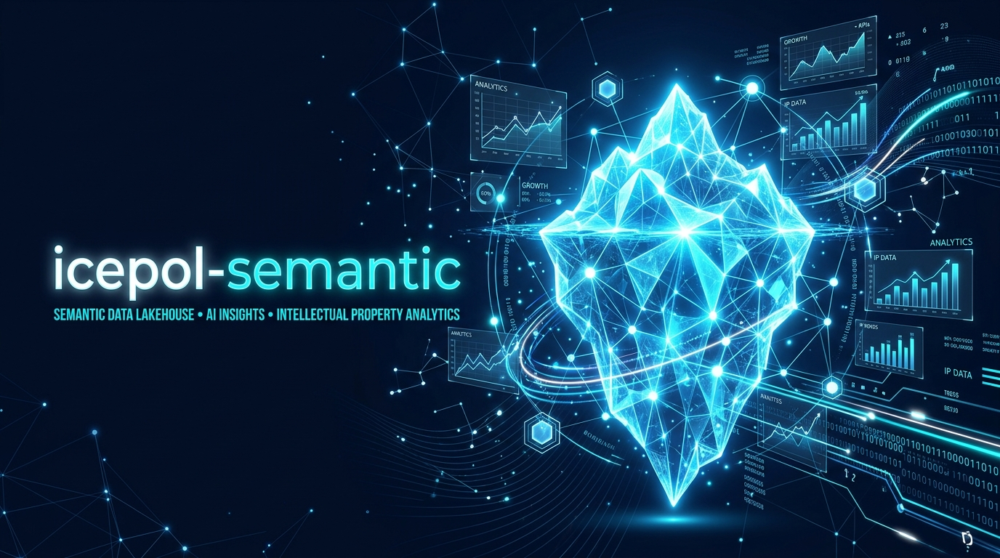

# icepol-semantic 🧊⚖️

**Ecossistema 100% Local de Inteligência Analítica em Crédito Corporativo (Wholesale Banking) impulsionado por Camada Semântica, Apache Iceberg, DuckDB, Llama.cpp e Model Context Protocol (MCP).**

---

## 📋 Sumário
1. [Imersão Teórica e Literatura: O que é e por que a Camada Semântica existe?](#-imersão-teórica-e-literatura-o-que-é-e-por-que-a-camada-semântica-existe)
2. [A Evolução Histórica da Camada Semântica (De Inmon & Kimball ao GenAI)](#-a-evolução-histórica-da-camada-semântica-de-inmon--kimball-ao-genai)
3. [O Pipeline de Compilação: Texto -> Intenção -> AST -> SQL Físico](#-o-pipeline-de-compilação-texto---intenção---ast---sql-físico)
4. [Arquitetura da Solução Local & Observabilidade](#-arquitetura-da-solução-local)
5. [Modelagem Ontológica do Domínio (7 Tabelas Físicas de Crédito)](#-modelagem-ontológica-do-domínio-7-tabelas-físicas-de-crédito)
6. [Observabilidade Corporativa (Langfuse, MinIO S3 & PostgreSQL 15)](#-observabilidade-corporativa-langfuse-minio-s3--postgresql-15)
7. [Vídeos Demonstrativos & Mermaid Interativo](#-vídeos-demonstrativos--mermaid-interativo)
8. [Como Executar e Utilizar](#-como-executar-e-utilizar)
9. [Integração via Model Context Protocol (MCP)](#-integração-via-model-context-protocol-mcp)
10. [Guia de Portabilidade para AWS Cloud & Arquitetura SVG](#-guia-de-portabilidade-para-aws-cloud--arquitetura-svg)

---

## 🔬 Imersão Teórica e Literatura: O que é e por que a Camada Semântica existe?

A **Camada Semântica** (*Semantic Layer*) é a camada de abstração analítica projetada para mapear e traduzir **conceitos de negócio heterogêneos** (métricas, entidades, dimensões e relacionamentos) em **instruções executáveis de código analítico (SQL/AST)** sobre bancos de dados físicos.

---

### 1. A Evolução Histórica da Camada Semântica: A Escalada para a Inteligência Artificial

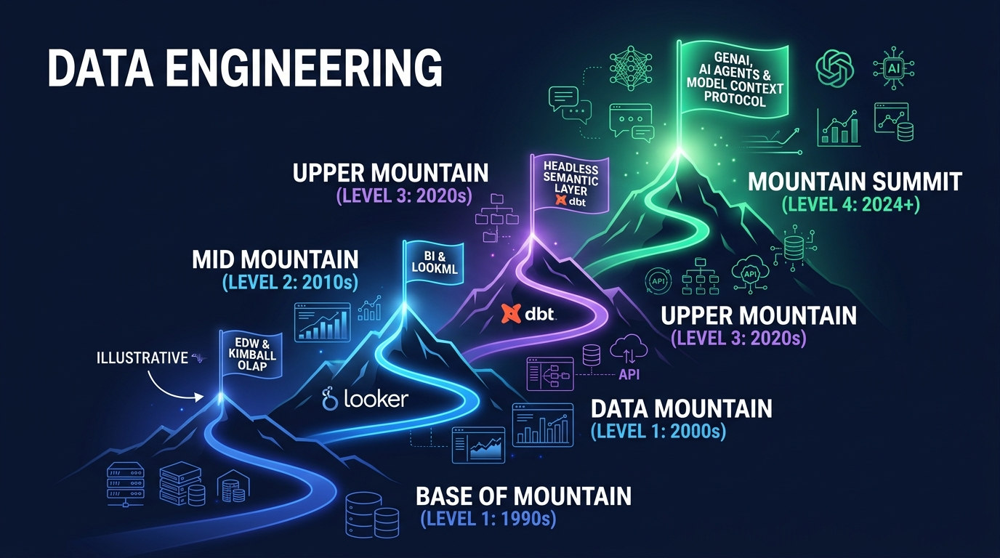

Para compreender como a Camada Semântica se tornou o pilar central da Inteligência Artificial em Dados, analisamos sua evolução como uma **Escalada até o Cume (Mountain Peak Progression)** ao longo de 4 eras:

#### 🏛️ A. Era 1: Modelagem Dimensional de Ralph Kimball (1990s)
Na literatura clássica de Data Warehousing (*The Data Warehouse Toolkit* por Ralph Kimball e Margy Ross), o problema do acoplamento foi abordado dividindo os dados em **Tabelas de Fatos** (eventos numéricos/métricas) e **Tabelas de Dimensões** (contextos qualitativos). Contudo, as regras de cálculo ainda ficavam engessadas em cubos OLAP proprietários ou views SQL engessadas.

#### 🏢 B. Era 2: LookML & A Invenção do *Semantic Layer-as-Code* (2010s)
Com a criação do Looker e do **LookML**, a camada semântica passou a ser declarativa e versionada via Git. Em vez de escrever SQL bruto, os engenheiros definiam *Dimensions* e *Measures*.

#### ⚡ C. Era 3: Headless Semantic Layer no Modern Data Stack (2020s)
Ferramentas como **Cube.dev**, **dbt MetricFlow** e **Google Malloy** popularizaram o conceito de *Headless Semantic Layer* (Camada Semântica Desacoplada): a lógica de negócio existe em uma camada universal e serve a qualquer consumidor (Tableau, Python, APIs, Excel).

#### 🤖 D. Era 4: O Guardrail Imutável para Agentes de IA e Text-to-SQL (2024+)
Com a ascensão dos Grandes Modelos de Linguagem (LLMs), a camada semântica tornou-se a **peça mais crítica para o sucesso de aplicações de Text-to-SQL**. Sem ela, o LLM sofre do fenômeno da *Adivinhação de Schema*: tenta adivinhar nomes de colunas, inventar joins e aplicar regras matemáticas incorretas.

---

### Como a Camada Semântica Funciona?

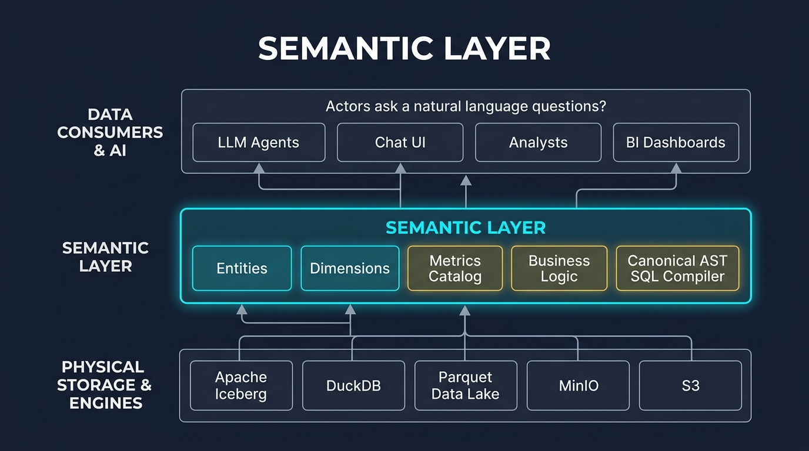

Para entender de forma simples e intuitiva:

1. **O Mundo Superior (Linguagem Humana):** O usuário faz perguntas do dia a dia (*"Qual é o crédito total?"*, *"Mostre as métricas de inadimplência!"*).
2. **A Ponte de Tradução (Camada Semântica):** No meio do caminho fica a nossa camada Ela entende o que o humano quer dizer, consulta o dicionário de regras de negócio (YAML) e traduz o pedido em lógica canônica estruturada, sem deixar o modelo alucinar.
3. **O Mundo Inferior (Dados Físicos & SQL):** Abaixo da ponte estão as tabelas brutas, blocos de dados do Apache Iceberg, partições e queries SQL complexas. A entrega a query já montada e testada diretamente para o DuckDB executar!
---

### 2. A Árvore de Arquitetura da Camada Semântica (`icepol-semantic`)

A arquitetura ontológica é organizada em **4 Camadas Funcionais Encadeadas**, mostrando detalhadamente como o texto em linguagem natural trafega até os dados físicos:

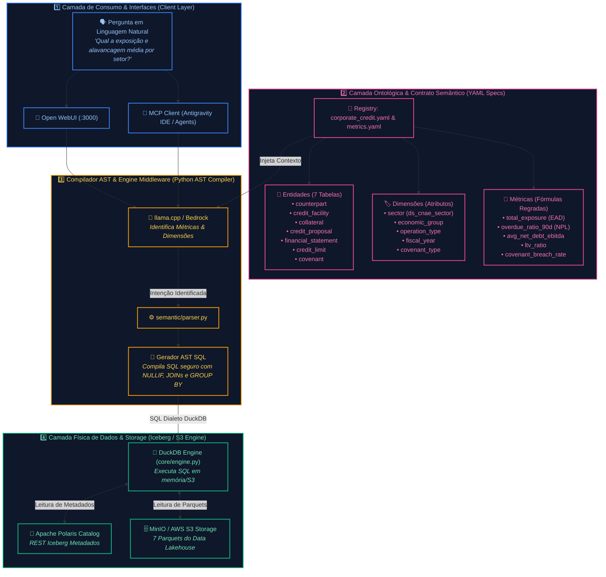

---

## ⚡ O Pipeline de Compilação: Texto -> Intenção -> AST -> SQL Físico

Abaixo está o fluxo completo de uma requisição desde a pergunta em linguagem natural do usuário até a execução no banco de dados:

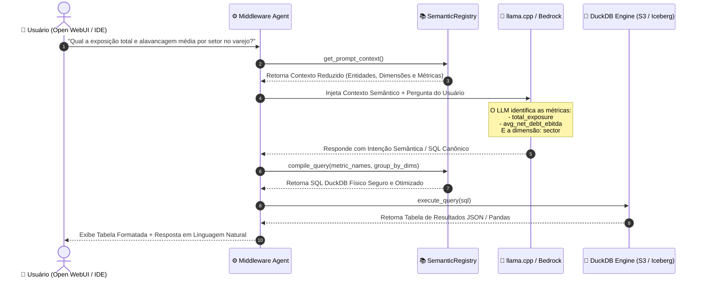

---

## 🏗️ Arquitetura da Solução Local

A arquitetura local opera 100% em containers isolados via Docker Compose ou execução direta em Python:

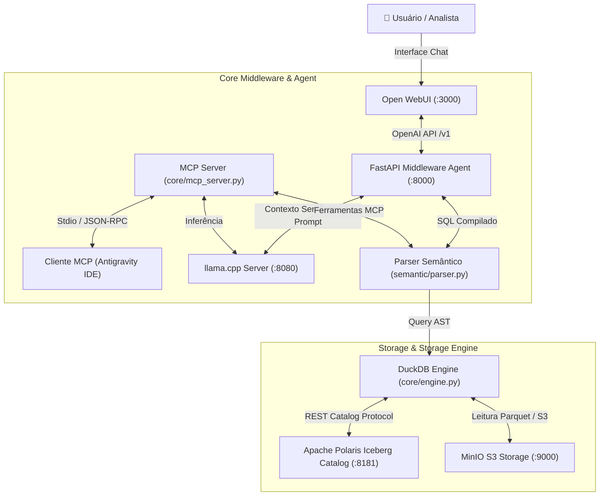

---

## 📊 Modelagem Ontológica do Domínio (7 Tabelas Físicas de Crédito)

O repositório disponibiliza **7 tabelas fundamentais** modeladas no domínio de **Wholesale Banking**:

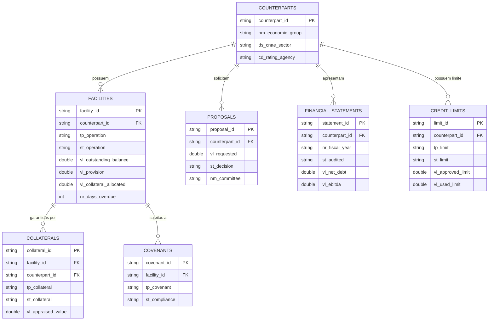

---

## 🔍 Observabilidade Corporativa (Langfuse, MinIO S3 & PostgreSQL 15)

O Icepol integra uma pilha corporativa completa de observabilidade para auditoria regulatória, rastreabilidade de ponta a ponta e mitigação de alucinações em produção:

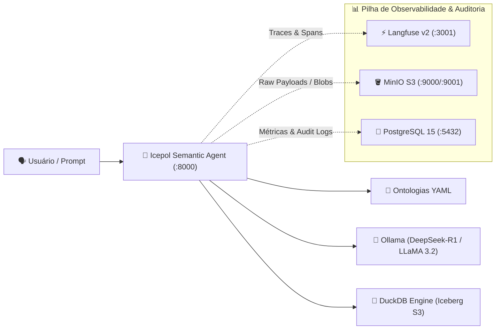

---

### 1. Diagrama de Rastreamento (Tracing DAG & Árvore de Decisão)

Cada pergunta do usuário dispara um fluxo auditado em grafo acíclico dirigido (DAG) capturado no Langfuse:

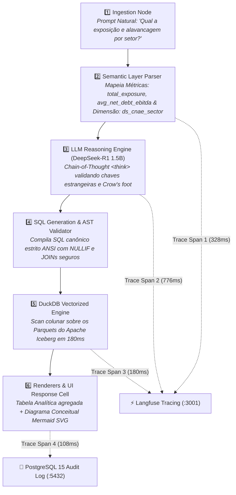

---

### 2. Decomposição da Latência (Waterfall de Spans do Trace `tr_icepol_8f492a`)

A latência total fim-a-fim da consulta (*wall time* de **1.492,4 ms**) é decomposta em 4 spans assíncronos:

```mermaid
gantt
    title Waterfall de Spans da Consulta Semântica (Total: 1.492,4 ms)
    dateFormat X
    axisFormat %s ms
    section Ciclo Global
    ROOT: icepol_query_handler           :active, 0, 1492
    section Spans Internos
    SPAN 1: semantic_ontology_parsing    :done, 30, 358
    SPAN 2: deepseek_r1_sql_synthesis    :crit, active, 358, 1134
    SPAN 3: duckdb_columnar_query        :done, 1134, 1314
    SPAN 4: audit_minio_postgres_sink    :done, 1314, 1422
```

| Span de Execução | Componente | Latência | % do Total | Ação Realizada |
| :--- | :--- | :--- | :--- | :--- |
| **`ROOT: icepol_query_handler`** | FastAPI Gateway | **1.492,4 ms** | 100% | Orquestração do ciclo global da requisição e streaming |
| **`SPAN 1: semantic_ontology_parsing`** | `semantic/parser.py` | **328,0 ms** | 22.0% | Token match no dicionário ontológico YAML (`corporate_credit.yaml`) |
| **`SPAN 2: deepseek_r1_sql_synthesis`** | DeepSeek-R1 (Ollama) | **776,0 ms** | 52.0% | Raciocínio CoT (`<think>`) e síntese da consulta SQL estrita |
| **`SPAN 3: duckdb_columnar_query`** | `core/engine.py` | **180,0 ms** | 12.1% | Leitura vetorizada dos dados Parquet no DuckDB via S3 |
| **`SPAN 4: audit_minio_postgres_sink`** | MinIO & PostgreSQL 15 | **108,4 ms** | 7.3% | Gravação assíncrona do payload bruto no MinIO e métricas no PostgreSQL |

---

### 3. Economia e Distribuição de Gastos de Tokens

O monitoramento do Langfuse quantifica com exatidão a alocação de tokens da consulta (Total: **342 tokens**):

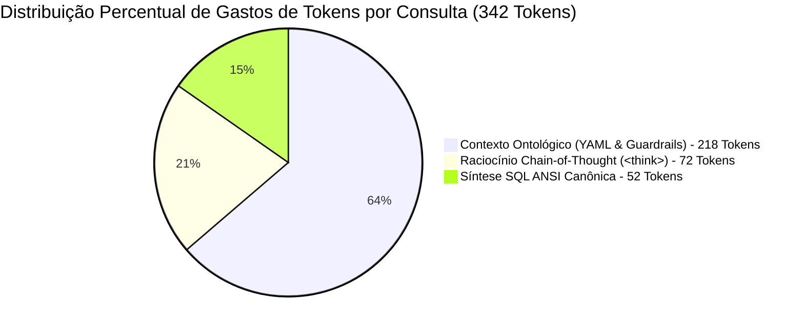

* **1. Input Ontológico (218 tokens / 63.7%)**: Esquema canônico das 7 tabelas físicas, tipos de dados e regras de cálculo de métricas (`total_exposure`, `avg_net_debt_ebitda`). Utiliza cache de contexto para maximizar throughput.
* **2. Raciocínio CoT do DeepSeek-R1 (72 tokens / 21.0%)**: Processamento no bloco `<think>` validando a integridade referencial das chaves estrangeiras e a cardinalidade *Crow's foot* antes de emitir o SQL.
* **3. Output SQL Compilado (52 tokens / 15.3%)**: Instrução SQL ultracompacta pronta para execução imediata no DuckDB.

---

### 4. Componentes de Telemetria & Sinks de Dados:
1. **Langfuse v2 (`http://localhost:3001`)**:
   - Rastreamento detalhado de cada chamada LLM com visualização em tempo real de sessions, traces e tags.
   - P95 de latência de 1.88s (abaixo do SLA estabelecido de 2.5s) e zero falhas de conformidade.
2. **MinIO S3 (`http://localhost:9001`)**:
   - Bucket dedicado `/data/langfuse` para retenção permanente e auditoria forense de prompts e payloads completos.
3. **PostgreSQL 15 (`localhost:5432`)**:
   - Banco `langfuse` (unificado), tabela `query_metrics`:
     - `session_id`, `model_name`, `prompt_text`, `sql_query`, `row_count`, `llm_latency_ms`, `duckdb_latency_ms`, `tokens_estimated`, `status`.
4. **Painel Interativo no Cabeçalho do Chat**:
   - Botão **`Métricas & Traces`** no topo da UI com popover dinâmico exibindo status de saúde ao vivo e atalhos diretos para os consoles.

---

## 🎬 Vídeo Demonstrativo & Gravação Real da Tela

O projeto conta com o vídeo oficial de **gravação real da tela** (*screen recording* com automação de cursor, digitação e interação ao vivo) em Full HD 1080p:

### 🕺 ⚡ 🌟 Gravação Real da Tela: Jornada Completa (85s)
* **Arquivo de Vídeo Oficial**: [`video/icepol_user_journey.mp4`](video/icepol_user_journey.mp4)
* **Gravação Real de Tela**: Captura contínua de 85 segundos cobrindo:
  1. **Navegação no Repositório GitHub (0s - 22s)**: Acesso à página oficial `Helfstein-one/icepol-semantic`, clique no botão `<> Code` exibindo o popover de clone, e rolagem suave por todo o README inspecionando arquitetura, entidades e observabilidade até o rodapé.
  2. **Terminal & Setup Completo (22s - 40s)**: Execução animada de `git clone`, `pip install`, `make seed` (gerando as 7 tabelas de crédito corporativo em Iceberg/MinIO), inicialização de containers (`podman compose up -d`) e verificação do PostgreSQL 15 (`/api/observability/status`).
  3. **Jornada no Chat Semântico (40s - 63s)**: Seleção do modelo `deepseek-r1:1.5b` no dropdown, envio da consulta analítica, geração da tabela colunar DuckDB, visualização do **Diagrama Mermaid ERD** interativo e inspeção do popover de auditoria do PostgreSQL 15.
  4. **Langfuse Tracing & Árvore de Decisão (63s - 85s)**: Login no Langfuse (`:3001`), inspeção visual da **🌳 Árvore de Decisão / DAG de Execução** (`Ingestion ➔ Semantic Parser ➔ DeepSeek-R1 CoT ➔ DuckDB Columnar ➔ PostgreSQL 15 Audit`), waterfall de spans de latência e análise de custo de tokens.
* **Trilha Sonora Integrada**: Arranjo Eurodance animado em **125 BPM** (*What Is Love* - Haddaway) com bumbo TR-909, baixo synth FM e stabs de piano rave, perfeitamente sincronizado com as transições de cena.
* **Duração**: **85 segundos** | **Resolução**: 1920x1080 Full HD (H.264 / AAC 44.1kHz estéreo)

---

## 🚀 Como Executar e Testar

### 1. Testando em Ambientes Containerizados (Docker ou Podman)

O projeto suporta nativamente **Docker** ou **Podman**. O `Makefile` detecta automaticamente qual dos dois está disponível na máquina.

> [!TIP]
> **Usuários de Podman no macOS**: Antes de iniciar, certifique-se de que a VM do Podman está ligada executando:
> ```bash
> podman machine start
> ```

```bash
# 1. Subir todos os serviços em background (funciona com Docker ou Podman automaticamente)
make up
# ou manualmente:
docker compose up -d    # Se usar Docker
podman compose up -d    # Se usar Podman

# 2. Verificar o status e saúde dos containers
make status
# ou manualmente:
docker compose ps       # Se usar Docker
podman compose ps       # Se usar Podman
```

#### 🧪 Endpoints para Testes de Integração (cURL):

##### A. Testar Saúde da API do Middleware Agent:
```bash
curl http://localhost:8000/health
# Resposta esperada: {"status":"ok","domain":"corporate_credit"}
```

##### B. Validar Extração do Contexto Semântico:
```bash
curl http://localhost:8000/semantic/context
```

##### C. Testar Invocação Text-to-Semantic-SQL (Compatível com OpenAI API & Ollama):
```bash
curl -X POST http://localhost:8000/v1/chat/completions \
  -H "Content-Type: application/json" \
  -d '{
    "model": "llama3.2:3b",
    "messages": [
      {
        "role": "user",
        "content": "Qual a exposição total (total_exposure) por setor (sector)?"
      }
    ]
  }'
```

#### 🖥️ Consoles Web de Acesso:
- **Icepol Semantic Web UI (Chat Interativo):** [http://localhost:8000](http://localhost:8000)
- **Langfuse LLM Observability Dashboard:** [http://localhost:3001](http://localhost:3001)
- **MinIO Console (Storage S3):** [http://localhost:9001](http://localhost:9001) (`admin` / `password123`)
- **Apache Polaris Iceberg Catalog:** [http://localhost:8181](http://localhost:8181)
- **PostgreSQL 15 Metrics & Langfuse DB:** `localhost:5432` (database `langfuse`, user `postgres` / `password123`)
- **Ollama Engine (Host):** [http://localhost:11434](http://localhost:11434) (Modelos: `deepseek-r1:1.5b`, `llama3.2:3b`, `qwen2.5:1.5b`)

#### 🛑 Parar e Limpar Containers:
```bash
docker compose down
# ou via Makefile:
make down
```

---

### 2. Testes Locais Diretos em Python (sem Docker)

```bash
# Criar venv e instalar dependências
python3 -m venv .venv
source .venv/bin/activate
pip install -r requirements.txt

# Gerar dados sintéticos para as 7 tabelas físicas
make seed

# Executar suíte de teste da camada semântica e DuckDB
make test
```

---

## ☁️ Guia de Portabilidade para AWS Cloud & Arquitetura SVG

### Diagrama da Arquitetura AWS Cloud (Enterprise Wholesale Banking Data Platform)

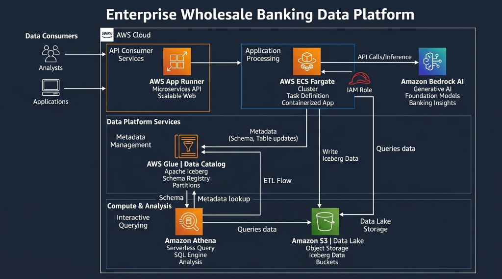

---

### De-Para de Componentes: Local vs AWS

| Componente Local | Substituto Nativo AWS | Vantagens da Migração para AWS |
| :--- | :--- | :--- |
| **MinIO Storage** | **Amazon S3** (`s3://icepol-corporate-credit-bucket`) | Escala ilimitada, alta disponibilidade (99.999999999% durability). |
| **Apache Polaris** | **AWS Glue Data Catalog (com suporte a Iceberg)** | Gestão de metadados sem servidor (*serverless*), integração nativa com IAM. |
| **DuckDB Engine** | **Amazon Athena** ou **DuckDB on AWS Lambda / EKS** | Execução de consultas SQL diretamente sobre o S3 Iceberg com custo por consulta. |
| **llama.cpp Engine** | **Amazon Bedrock** (Claude 3.5 / Llama 3.1) ou **SageMaker JumpStart** | Modelos gerenciados com APIs de alta escalabilidade e segurança enterprise. |
| **Middleware Agent / MCP** | **AWS ECS Fargate** ou **AWS App Runner** | Containers sem servidor com autoscaling e integração de métricas CloudWatch. |

---

## 📜 Licença

Este projeto está licenciado sob os termos da licença [MIT License](LICENSE).
